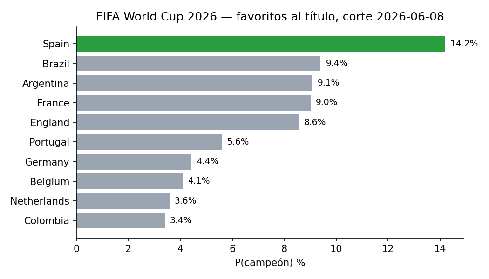

# I Built This Model for 2026 World Cup Prediction Pools

*[Léeme en español](README.es.md)*

[](https://github.com/poncho-ajmv/mundial-2026/actions)   

I built it before the World Cup started to make prediction pools based on data rather than
intuition. It estimates 1X2 probabilities for every match, qualifiers, round-by-round
odds and the title favourite using international match history, six models and 30,000
Monte Carlo simulations.

The forecast was generated on 10 June 2026, before the opening match, using data through
8 June: **Spain champion (14.6%), final Spain–Argentina**. This is a pre-tournament
snapshot and contains no later results.



| What it adds to a prediction pool | Estimate |
|---|---|
| Title favourite | Spain, 14.6% |
| Most likely final | Spain–Argentina |
| Group-stage matches | 72 1X2 and xG forecasts |
| Quality reference | Backtest: log-loss 0.943 · random 1.099 |

A 14.6% title probability means the model expects to be wrong about 6 times out of 7. It
is a pre-tournament estimate, not a claim about the final result.

---

## Documents

- [Pre-tournament report (10 June)](reports/2026-06-10-pre-torneo.pdf): the original
  forecast for prediction pools, generated before the opening match.
- [Technical memo and retrospective (July)](docs/2026-07-memoria-tecnica-post-torneo.pdf):
  model decisions, tournament evaluation and lessons learned after it was played.

---

## Usage

```bash
git clone https://github.com/poncho-ajmv/mundial-2026.git
cd mundial-2026
pip install -r requirements.txt
python scripts/run_pretournament.py
```

Expected tail of the output (about 40 seconds):

```
=== Favoritos al título (corte 2026-06-08) ===
  Spain             14.2%   (final 22.8%)
  ...
  invariante: las probabilidades de campeón suman 100.0%
```

The commands you will actually use:

| Command | What it does |
|---|---|
| `python scripts/run_pretournament.py` | Forecast with data cut at the edition's date; writes `outputs/` |
| `python scripts/run_pretournament.py --edition wc2030` | Another tournament, described in `editions/` |
| `python src/backtest.py` | The exam: 10 past tournaments, 482 matches, ~2 min |
| `python scripts/compare_published.py` | Regression test against the report of 10 June |
| `python scripts/build_notebook.py` | Regenerate and execute the self-contained notebook |
| `pytest` | Invariants and leakage check |

`notebooks/mundial_2026.ipynb` is the whole system in one self-contained notebook —
engine, forecast and backtest — with the opening match México–Sudáfrica as the running
example. It is generated from `src/` and runs on its own.

---

## Requirements

| | Version | Why |
|---|---|---|
| **Python** | **3.10+** | `from __future__ import annotations` and `X \| Y` types; CI runs 3.11 |
| pandas, numpy, scipy, scikit-learn | see `requirements.txt` | Data, Elo, logistic and Poisson regressions |
| xgboost | 2.0+ | One of the six panelists |
| matplotlib, jupyter | | Figures and the notebook only |

No GPU, no servers, no paid data. Runs on a laptop.

---

## Architecture (C4 model)

### Level 1 — Context

```plantuml
@startuml C4_Level1_Context
!include https://raw.githubusercontent.com/plantuml-stdlib/C4-PlantUML/v2.4.0/C4_Context.puml
LAYOUT_WITH_LEGEND()

title Level 1 — Context · World Cup 2026 forecaster

Person(analyst, "Analyst", "Runs the forecast, reads the report")

System(forecaster, "World Cup forecaster", "Match probabilities, qualifiers, round odds and title favourite from match history")

System_Ext(results, "International results", "martj42/international_results (CC0): every international match since 1872")
System_Ext(values, "Squad market values", "Transfermarkt snapshot via a public dataset")
System_Ext(fifa, "FIFA regulations", "Groups, bracket, tiebreakers of the edition")

Rel(analyst, forecaster, "Runs", "CLI / notebook")
Rel(forecaster, results, "Reads", "CSV")
Rel(forecaster, values, "Reads", "JSON")
Rel(forecaster, fifa, "Encodes", "editions/*.json")
@enduml
```

### Level 2 — Containers

It is one process: scripts and notebook over the same package, reading and writing
files on disk. Two containers only because data and outputs are files, not code.

```plantuml
@startuml C4_Level2_Containers
!include https://raw.githubusercontent.com/plantuml-stdlib/C4-PlantUML/v2.4.0/C4_Container.puml
LAYOUT_WITH_LEGEND()

title Level 2 — Containers · World Cup 2026 forecaster

Person(analyst, "Analyst", "")

System_Boundary(sys, "World Cup forecaster") {
  Container(engine, "Engine", "Python 3.10+ · src/, scripts/, notebooks/", "Elo, features, model panel, ensemble, simulation, backtest")
  ContainerDb(data, "Data", "CSV / JSON on disk · data/, editions/", "Match history, groups, squad values, edition config, published reference")
  Container(outputs, "Outputs", "CSV / JSON / PNG · outputs/, docs/figures/", "Match probabilities, round odds, backtest results, figures")
}

System_Ext(results, "International results", "")
System_Ext(values, "Squad market values", "")

Rel(analyst, engine, "Runs", "python scripts/*.py · jupyter")
Rel(engine, data, "Reads", "pandas")
Rel(engine, outputs, "Writes", "pandas · matplotlib")
Rel(data, results, "Refreshed from", "curl")
Rel(data, values, "Built from", "scripts/build_squad_values.py")
@enduml
```

### Level 3 — Components of the engine

Every component is a real file under `src/`. The data flows left to right; the backtest
re-runs the whole chain once per past tournament.

```plantuml
@startuml C4_Level3_Components
!include https://raw.githubusercontent.com/plantuml-stdlib/C4-PlantUML/v2.4.0/C4_Component.puml
LAYOUT_WITH_LEGEND()

title Level 3 — Components · Engine (src/)

ContainerDb(data, "Data", "", "data/, editions/")
Container(outputs, "Outputs", "", "outputs/")

Container_Boundary(engine, "Engine") {
  Component(config, "config", "src/config.py", "Every knob in one place: Elo K and home advantage, windows, half-lives, panel hyperparameters, seeds")
  Component(dataio, "data", "src/data.py", "Loads and normalises results, groups, squad values, editions; date cut; tournament weights; confederations")
  Component(eng, "engine", "src/engine.py", "One chronological pass: Elo ratings and the eleven point-in-time features. Features are recorded before the result is processed")
  Component(models, "models", "src/models.py", "The panel: Elo-logit, multinomial logit, XGBoost, Random Forest, Dixon–Coles (goals), squad value")
  Component(ens, "ensemble", "src/ensemble.py", "Weights learned on the last 30% chronologically, temperature calibration, metrics (log-loss, RPS, Brier, ECE)")
  Component(sim, "simulate", "src/simulate.py", "30,000 tournaments: outcome from the ensemble, scoreline from Dixon–Coles, FIFA tables, best thirds, bracket, penalties")
  Component(bt, "backtest", "src/backtest.py", "Rolling-origin exam over 10 past tournaments, averaged per tournament")
}

Rel(dataio, data, "Reads", "CSV / JSON")
Rel(dataio, eng, "Normalised matches")
Rel(eng, models, "Feature matrix")
Rel(models, ens, "Six probability triples per match")
Rel(ens, sim, "Calibrated 1X2 + score matrix")
Rel(sim, outputs, "Writes", "CSV")
Rel(bt, eng, "Re-runs per tournament")
Rel(bt, ens, "Scores")
Rel(config, eng, "Parameters")
Rel(config, models, "Parameters")
@enduml
```

The three rules the components enforce:

1. **Information flows only from past to future.** `engine.py` records a match's
   features before it processes that match's result; a test flips the opener's score to
   0–9 and checks that none of its features move.
2. **Every improvement is demonstrated, not argued.** Nothing changes in `config.py`
   without beating `backtest.py`. Home advantage is 100 Elo points because 100 won the
   exam over 55, 80 and 120.
3. **Every published number comes from the model.** Reports and figures are generated
   from `outputs/`, never typed.

---

## Validation

Rolling-origin backtest over 10 real tournaments (World Cups 2014/18/22, Euros
2016/21/24, Copa América 2019/21/24, Asian Cup 2019), 482 matches, training only on data
available before each one. `python src/backtest.py`:

| Model | log-loss ↓ | RPS ↓ | Brier ↓ | Accuracy ↑ |
|---|---|---|---|---|
| **Ensemble** | **0.942** | **0.185** | **0.557** | **56.3%** |
| Multinomial logit | 0.943 | 0.186 | 0.558 | 55.7% |
| XGBoost | 0.948 | 0.187 | 0.562 | 56.0% |
| Elo-logit | 0.949 | 0.187 | 0.562 | 55.0% |
| Dixon–Coles | 0.949 | 0.186 | 0.562 | 55.7% |
| Random Forest | 0.952 | 0.188 | 0.564 | 54.8% |
| Uniform random | 1.099 | 0.222 | 0.667 | 33.3% |

The ensemble ties the best single model on log-loss and is kept for stability across
tournaments, not accuracy.

---

## Project structure

```
mundial-2026/
├── src/           config, data, engine, models, ensemble, simulate, backtest
├── scripts/       run_pretournament, compare_published, build_squad_values, build_notebook
├── notebooks/     mundial_2026.ipynb — self-contained, executed
├── editions/      one JSON per tournament: dates, cut, groups, bracket
├── data/          results.csv (CC0), shootouts.csv, groups, squad values, published reference
├── outputs/       generated predictions and backtest results
├── docs/          forecast figures and post-tournament technical memo
├── reports/       the pre-tournament report of 10 June 2026
└── tests/         invariants and point-in-time check
```

## Adapting it to another tournament

Copy `editions/wc2026.json`, change the dates, the groups file and the bracket slots, and
run with `--edition`. The 12×4 group format with 32 qualifiers is fixed in
`simulate.py` (`GROUPS` and the number of best thirds): an 8×4 format is two constants.
Details in `editions/README.md`.

---

## Verify it works

```bash
pytest -q
```

Five checks: 72 matches with no NaN, every triple sums to 1, round totals are exactly
32/16/8/4/2/1, the point-in-time guarantee, and the documented home-advantage value.

---

## Troubleshooting

**`No module named xgboost`** — `pip install -r requirements.txt` inside the
environment you run from; on Debian/Ubuntu system Python add `--break-system-packages`.

**The notebook says `No module named data`** — you are running a hand-edited notebook.
Regenerate it: `python scripts/build_notebook.py`. The notebook embeds `src/`; it does
not import it.

**Squad values missing for a team** — `build_squad_values.py` imputes them from Elo and
flags the row in the `imputed` column. To disable the panelist entirely: `--no-value`.

---

## Project status

**Works and is verified**
- Elo, eleven point-in-time features, six-model panel, calibrated ensemble
- 30,000-run simulation with FIFA tables, best thirds and official bracket
- 10-tournament backtest; regression test against the published report
- Self-contained executed notebook; CI running the invariants

**Not in the repository**
- An automated PDF report generator.
- Best-third placement uses merit order, not FIFA's Annex C table. Documented in
  `simulate.py`; main source of error in round-by-round odds.

**Roadmap** — xG and event data, a penalty-shootout model, automated live capture, a
draw classifier and full FIFA tiebreakers.

---

## License

Code: MIT ([`LICENSE`](LICENSE)). Documents and reports: CC BY 4.0
([`LICENSE-docs.md`](LICENSE-docs.md)). Match history: CC0, from
[martj42/international_results](https://github.com/martj42/international_results).
Squad values: aggregated Transfermarkt figures via a public dataset; see
[`data/README.md`](data/README.md).

Alfonso Moraga, 2026.
